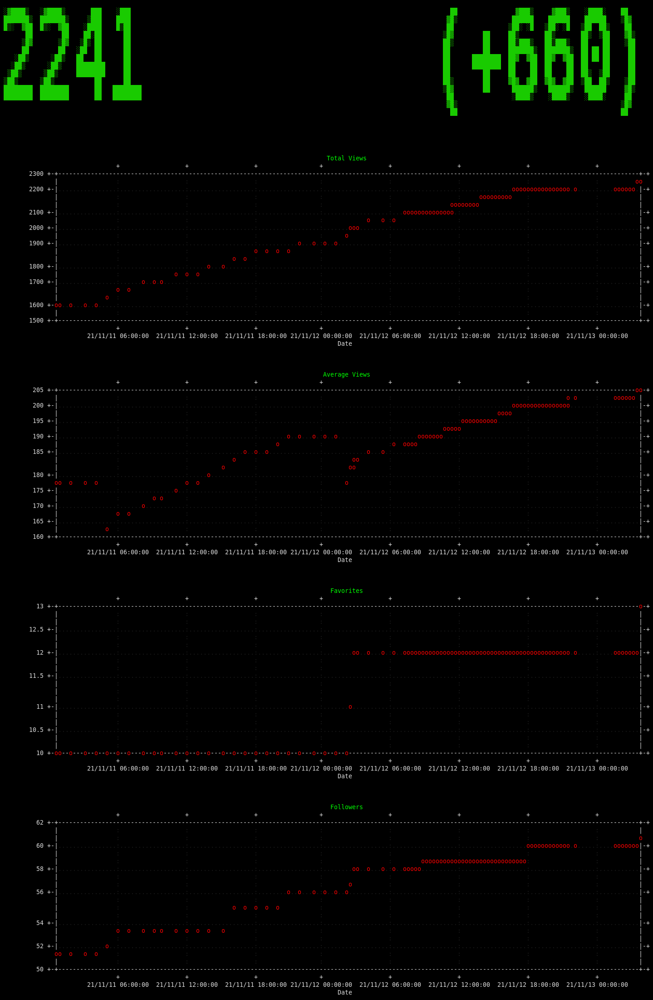

# Royal Road Stats Tool

For authors that want to see pretty graphs of the stats they can see
for free (views, followers, rank) but don't need the detailed
drill-downs and additional analytics that can only be measured with
author premium (reader retention, lists of followers), this tool will
periodically scrape your fiction's front-page, extract the public
stats, and store them so you can graph them.



# Installation

Dependencies: [figlet](http://www.figlet.org/),
[gnuplot](http://www.gnuplot.info/). On debian relatives:

```sh
sudo apt-get install figlet gnuplot
```

Install rr_stats from github using pipx.

```sh
pipx install git+https://github.com/vebyast/rr_stats.git
```

## using systemd

Copy the systemd service and timer units into your systemd user unit
directory:

```sh
curl https://raw.githubusercontent.com/vebyast/rr_stats/main/systemd/rr_sample.service > ~/.config/systemd/user/rr_sample.service
curl https://raw.githubusercontent.com/vebyast/rr_stats/main/systemd/rr_sample.timer > ~/.config/systemd/user/rr_sample.timer
```

Edit the systemd service unit to fill in the path that `pipx`
installed `rr_stats_sample` to and your fic's URL (`YOUR_FIC_URL_HERE`
in the following snippet):

```sh
sed -i "s|/absolute/path/to/rr_stats_sample|$(which rr_stats_sample)|" ~/.config/systemd/user/rr_sample.service
sed -i "s|https://www.royalroad.com/REPLACE_ME|YOUR_FIC_URL_HERE|" ~/.config/systemd/user/rr_sample.service
```

Enable and start the service:

```sh
systemctl --user daemon-reload 
systemctl --user enable rr_sample.service
systemctl --user start rr_sample.service
```

## using cron

Easier but less debuggable and doesn't tolerate downtime as well:

```sh
crontab -l | { cat ; echo '0 * * * * rr_stats_sample YOUR_FIC_URL_HERE'} | crontab -
```

# Usage

Run `rr_stats_graph` to view your stats. Run `rr_stats_watch` to view
your stats and refresh the graphs and numbers whenever your background
job goes out and gets new stats.

Probably best used on a portrait-mode display or at least on a tall,
thin window on a very large screen.

# Details

Stores data in a sqlite3 database at
`$XDG_DATA_HOME/rr_stats/rr_stats.sqlite`. Can only track a single fic
right now; feel free to send me a PR adding multi-fic support.
